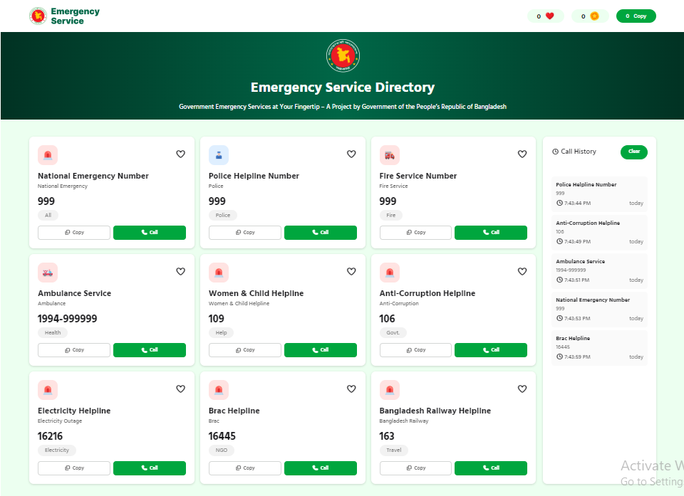
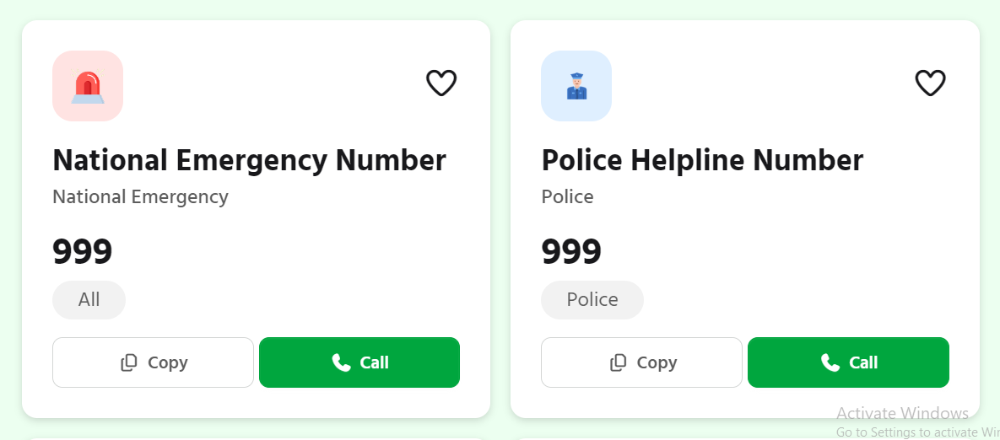
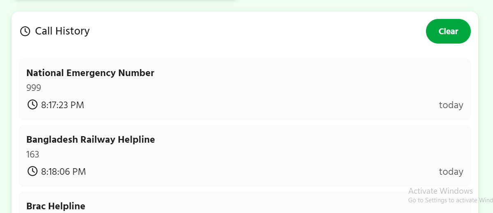
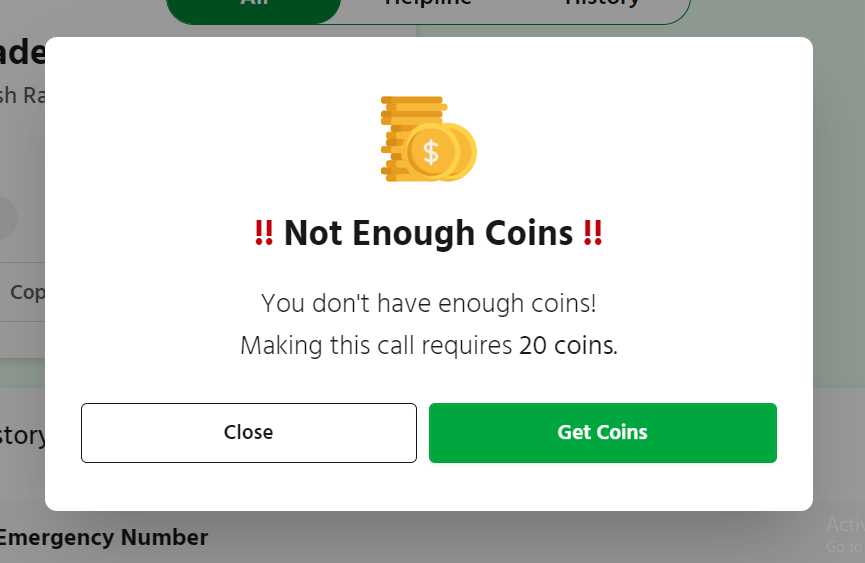
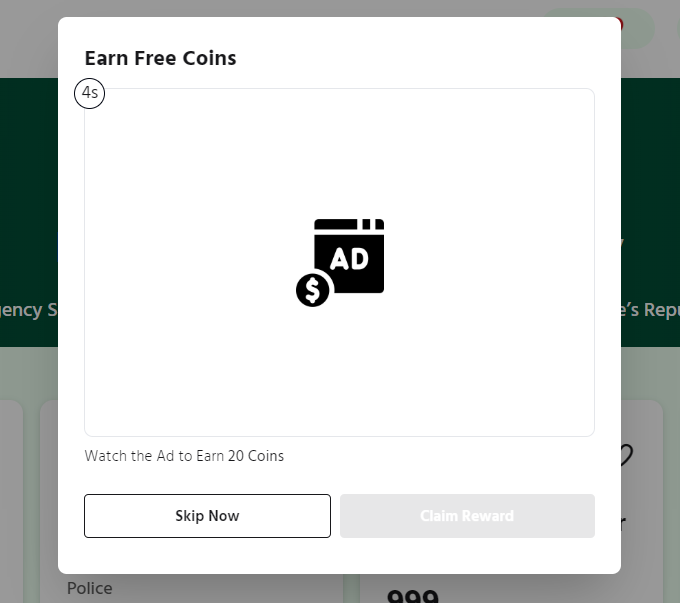
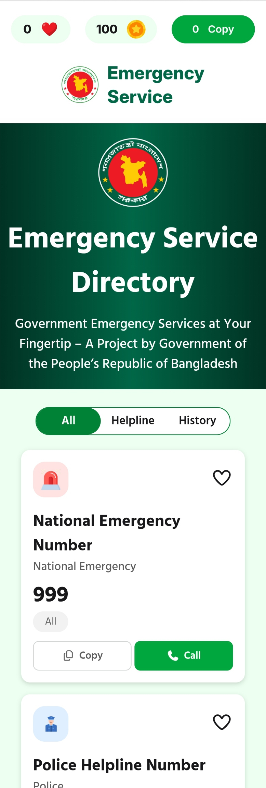

# Emergency Service Directory 🚨

A practice project that provides easy access to government emergency service numbers in Bangladesh.
This project simulates **calling, copying numbers, and earning/spending coins** while interacting with services.

---

## 🖼️ Main Interface

---

## 🔹 Navbar

The navbar shows three counters:

* **Love ❤️** → Total services marked as favorite.
* **Coin 💰** → Current coin balance. Each call costs 20 coins.
* **Copy 📋** → Total numbers copied by the user.

---

## 🔹 Directory Card

Each service is displayed as a card with:

* **Directory Name** (e.g., Police Helpline, Fire Service)
* **Service Number** (e.g., 999, 106)
* **Copy Button** → Copies the number to the clipboard.
* **Call Button** → Opens demo call modal.

---

## 🔹 Calling Section (Demo Only)

* Clicking **Call** opens a **demo call modal**.
* Shows a **realistic call interface** with service name and number.
* Plays a **fake ringing sound** for realism.
* **This is demo only – not a real call.**
* After ending the call, details are saved in **Call History**.

---

## 🔹 Call History

* Every call is recorded in the history panel.
* Shows **service name, number, and time of call**.

---

## 🔹 Coin System

* **Every call costs 20 coins.**
* If coins < 20 → Call cannot be placed.
* A modal appears with **Get Coins** option.

---

### 🟢 Earning Coins

Two ways to earn coins:

1. **From Navbar Coin Button**

   * Click coin counter → Shows **ad modal**.
   * Watch ad for 5 seconds.
   * After timer, **Claim Reward** button activates → Coins added.

   

2. **After Failed Call (Low Coins)**

   * Same process as above.
   * Watch ad → Wait 5 seconds → Claim reward → Earn coins.

## 🔹 Responsiveness 📱💻

* The project is **fully responsive** and works smoothly across:

  * Mobile screens
  * Tablets
  * Desktops
* Layouts, modals, and navigation adapt automatically to different screen sizes for the best user experience.

---

## ⚙️ How It Works (Flow)

1. User selects a service card.
2. Clicks **Copy** → Number copied (counter updates).
3. Clicks **Call** → Opens demo call modal.

   * If coins ≥ 20 → Call starts (demo interface + sound), coins deducted, history updated.
   * If coins < 20 → "Not enough coins" modal appears.
4. User watches ad → Waits 5 seconds → **Claim Reward** → Coins added.

---

## 🛠️ Tech Used

* HTML
* Tailwind CSS
* DaisyUI
* JavaScript

---

## 📌 Future Improvements

* Real API integration for calling.
* User authentication and saved preferences.
* More services and categories.